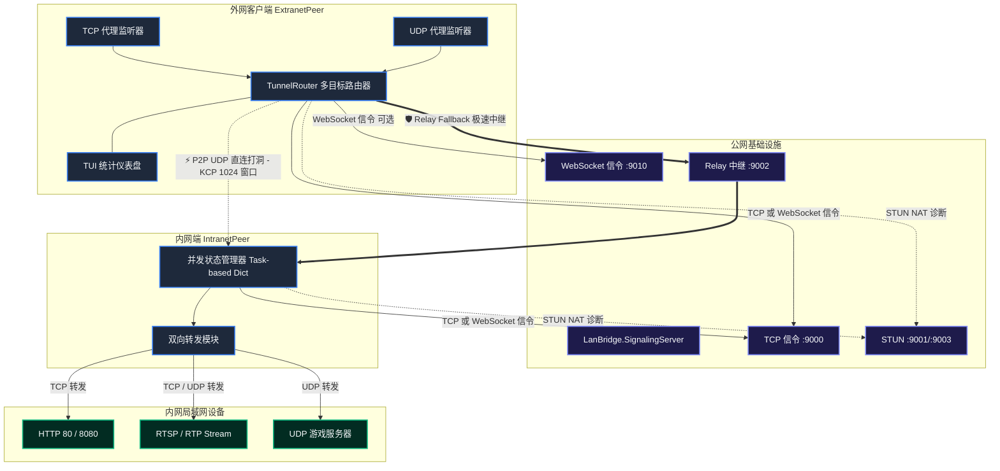

# ⚡ LanBridge: 高性能 P2P 局域网穿透隧道工具

<p align="center">
  <a href="#-特性"><strong>特性</strong></a> |
  <a href="#-系统架构"><strong>系统架构</strong></a> |
  <a href="#-快速开始"><strong>快速开始</strong></a> |
  <a href="#-配置文件示例"><strong>配置指南</strong></a> |
  <a href="#-websocket-信令传输"><strong>WebSocket 信令</strong></a> |
  <a href="#-传输模式与性能调优"><strong>性能调优</strong></a> |
  <a href="#-访问控制与安全"><strong>访问控制</strong></a>
</p>

---

**LanBridge** 是一个基于 **.NET 10** 构建的高性能、极轻量的内网穿透隧道工具。它支持标准 **STUN 协议 (RFC 5389)** 以及 **双向 UDP / TCP 端口转发**，能让您在公网环境下安全、流畅地访问位于内网局域网中的任意服务（例如：RTSP 监控流、HTTP 服务、WebSocket、UDP 游戏服务器、DNS 等）。

项目核心采用 **KCP 可靠 UDP 传输层** 并辅以高度的内存零分配（Zero-Allocation Buffer Pooling）与状态锁设计，确保极高吞吐量的同时，消除了高并发下的 GC 垃圾回收卡顿。

---

## ✨ 核心特性

- 🌐 **双协议端口转发**：不仅支持经典的 TCP（HTTP、RTSP over TCP、WebSocket、SSH），还完美支持 **UDP 端口转发**（RTSP UDP、游戏服务器、DNS 等），并且配有智能连接老化清理（Idle Timeout Pruning）防泄露机制。
- 🚀 **局域网自发现与极简免配置本地直连**：同子网或邻近网段下自动启用基于 UDP 多播（`239.255.0.1`）与广播（`255.255.255.255`）的自发现协议，直接建立 KCP 隧道（建连耗时 **< 2ms**），100% 绕过公网信令及 STUN NAT 诊断，并提供无缝的公网打洞和中继 fallback 级联后备。
- 🚀 **UDP 非可靠高速通道（UDP Unreliable Mode）**：针对 UDP 端口映射（如 RTSP 视频流、UDP 游戏数据包等对实时性要求极高、允许少量丢包的场景），当 P2P 直连打洞成功后，数据帧将直接通过原始不可靠的 UDP 套接字进行发送，彻底绕过 KCP 的重传、拥塞控制和重组开销，从而消除网络抖动带来的画面堆积 and 卡顿；在降级至 TCP Relay 中继模式时，则自动恢复为可靠的 KCP 交付，确保传输的绝对兼容性与高鲁棒性。
- 🎯 **对称 NAT 端口预测穿透（Symmetric NAT Port Prediction）**：针对双侧 NAT 中有一侧为“对称型（Symmetric）”NAT 导致常规打洞失败的情况，打洞管理器引入了智能端口预测算法。处于锥形（Cone）NAT 侧的客户端会在发起打洞时，自动向对称 NAT 侧预测的连续端口区间（首端口 +1 至 +8，以及 -1 至 -3）并发发送 PUNCH 探测包，最大化捕获对称 NAT 的端口递增分配规律，大幅提高以往被视为 P2P 禁区的对称 NAT 穿透成功率。
- ⚡ **零拷贝与零分配高性能数据管道**：重新设计了 `TunnelFrame` 消息传输首部与 socket 读写机制。通过预留首部偏移、直接在 `ArrayPool` 租用缓冲区上进行 in-place 编码与底层 Socket 零拷贝收发，使数据通路上的内存分配与拷贝次数降至 **绝对的零**，彻底消除 GC 压力。
- 🌪️ **弱网自适应 KCP 动态拥塞控制**：全面重构了重传与拥塞控制引擎。实现了标准 RTT/RTO 高精度动态时间戳估算、完整的快速重传（Fastack）、TCP Fast Recovery（快速恢复，避免丢包时拥塞窗口崩溃式重置为 1），并创造性地加入了 BBR 风格的排队延迟估计，智能甄别**无线随机丢包**与**真实网络拥塞**，使 15% 高丢包弱网环境下的吞吐速率飙升 **1.55 倍**。
- 📦 **零反射 Native AOT 原生编译**：三端核心完全重构为 100% 零反射架构，全量采用 System.Text.Json 源生成器（Source Generators）。可一键编译为体积仅 **3.6MB - 4MB** 的独立原生二进制单文件，无需任何外部运行时或 .NET SDK 依赖，拷走即跑，毫秒级启动！
- 🚀 **IPv4/IPv6 双栈并行打洞 (Happy Eyeballs 机制)**：采用单套接字双栈绑定（支持 `[::]` 自动回退），引入类 Happy Eyeballs 并行打洞策略（IPv6 优先 30ms 启动，IPv4 协同竞速），智能选路激活最快 P2P 路径，显著提升现代网络下的穿透成功率。
- 🧊 **零分配级内存优化**：传输载荷的字节缓冲区完全采用 `System.Buffers.ArrayPool<byte>.Shared` 线程安全对象池，杜绝堆内存碎片与 GC 停顿，保障高吞吐下的平稳运行。
- 🎯 **标准 STUN RFC 5389**：集成原生无外部依赖的标准 STUN 解析，消除 CPU 字节序架构依赖性，完美支持标准 STUN 公网服务器和 NAT 诊断功能。
- 🤝 **首包零丢失竞态防护**：使用 Task 驱动的异步状态同步结构保护内网目标连接，彻底消除 UDP/KCP 穿透初期的异步数据包到达竞争，实现首包 100% 成功交付。
- 🔁 **信令自动重连与高可用容灾**：客户端内置后台连接管理器。当信令服务器在启动时离线时，客户端会自动以 5 秒周期进行重试而不会闪退；在运行期如果遭遇信令断连，客户端也能即时捕获，并在信令服务器恢复后自动重建连接并重新注册，保障隧道在无人值守环境下的绝对稳定性。
- 🔗 **P2P 优先与自动中继后备**：优先尝试打洞建立 P2P UDP 直连；在 NAT 条件极差（如双侧对称 NAT）时，秒级无缝降级到 **Relay 中继模式**。
- 🖥️ **实时 TUI 统计仪表盘**：ExtranetPeer 支持 `--tui` / `--dashboard` 启动参数，运行时在终端实时展示传输模式、连接状态、带宽速率、KCP 统计等关键指标，适合运维监控和调试。
- 🔀 **多隧道多目标路由**：单台 ExtranetPeer 可同时连接多个 IntranetPeer 节点。通过映射中 `@nodeId` 后缀（如 `8554=192.168.7.230:554:tcp@peer-001`）指定每个端口转发到不同的内网节点，内部由 `TunnelRouter` 管理共享 UDP 栈和信令栈。
- 🚧 **WebSocket 信令传输通道** *(开发中)*：在传统 TCP 信令连接基础上，新增 WebSocket 传输选项，适用于受限于 HTTP 代理或防火墙仅允许出站 WebSocket 的网络环境。支持 `auto` 模式自动回退（先 TCP → 失败后 WS）。客户端与服务端代码已实现，CLI 参数与服务端启动集成待完成。
- 🚧 **带宽限速与 QoS 优先级** *(开发中)*：每个端口映射可独立配置 `rateLimitBytesPerSec`（字节/秒上限，0 = 不限速）和 `priority`（`high` / `normal` / `low`），确保关键实时流量优先于后台大流量传输。数据模型、令牌桶与优先级队列已实现，运行时接入待完成。

---

## 🏗️ 系统架构



---

## 📂 项目结构

```text
LanBridge/
├── src/
│   ├── LanBridge.Common/           # 核心公共库：STUN协议、KCP传输层、安全帧、WebSocket信令客户端、TUI仪表盘、多目标路由
│   ├── LanBridge.SignalingServer/  # 公网服务端：TCP/WebSocket信令、STUN NAT诊断、TCP中继服务
│   ├── LanBridge.IntranetPeer/     # 内网穿透客户端：并发白名单访问控制、TCP/UDP双向连接池
│   └── LanBridge.ExtranetPeer/     # 外网访问客户端：本地TCP/UDP端口监听、多目标路由、TUI仪表盘
└── examples/                       # 标准生产配置模板 (TCP & UDP 样例)
```

---

## 🚀 快速开始

### 1. 部署公网服务端

服务端需要部署在拥有公网 IP 的服务器上，并默认监听或放行以下端口：
* **TCP `9000`**：信令服务端口
* **UDP `9001`**：标准 STUN 服务端口
* **TCP `9002`**：Relay 数据中转端口
* **UDP `9003`**：辅助 STUN 服务端口（用于高精度 NAT 分类与诊断）

```bash
# 直接运行启动
dotnet run --project src/LanBridge.SignalingServer

# 或加载自定义配置文件
dotnet run --project src/LanBridge.SignalingServer -- -c server.config.json

# 启用注册令牌保护
dotnet run --project src/LanBridge.SignalingServer -- \
  --require-token \
  --registration-token lanbridge-prod-token
```

---

### 2. 启动内网代理端 (IntranetPeer)

在内网端，根据安全要求可以指定特定的局域网段白名单。例如，允许外网客户端访问 `192.168.7.0/24` 网段内的任意 TCP 及 UDP 服务：

```bash
dotnet run --project src/LanBridge.IntranetPeer -- \
  --signaling-host lanbridge.yourdomain.com \
  --stun-host lanbridge.yourdomain.com \
  --allow-subnet 192.168.7.0/24
```

> [!TIP]
> 也可以通过指定多个 `--allow-target 192.168.7.230:554` 来进行极细粒度的端口安全隔离限制。如需通过注册令牌保护，加上 `--token <your-token>` 参数。

**常用参数速查：**

| 参数 | 缩写 | 说明 | 默认值 |
|------|------|------|--------|
| `--signaling-host` | `-sh` | 信令服务器地址 | `127.0.0.1` |
| `--signaling-port` | `-sp` | 信令服务器端口 | `9000` |
| `--stun-host` | `-sth` | STUN 服务器地址 | `127.0.0.1` |
| `--stun-port` | `-stp` | STUN 服务器端口 | `9001` |
| `--stun-alt-port` | — | STUN 辅助端口 | `9003` |
| `--token` | `-t` | 注册令牌 | `default-token` |
| `--target-host` | `-th` | 默认目标主机 | `127.0.0.1` |
| `--target-port` | `-tp` | 默认目标端口 | `554` |
| `--allow-target` | `-at` | 允许的目标 `host[:port\|:*]` | — |
| `--allow-subnet` | — | 允许的子网 `cidr[:port]` | — |
| `--udp-port` | `-up` | P2P UDP 端口 | 随机 |
| `--verbose` | `-v` | 详细 KCP 诊断 | `false` |

---

### 3. 启动外网访问客户端 (ExtranetPeer)

使用强大的 `-m` / `--map` 标志支持跨协议配置（格式：`localPort=targetHost:targetPort[:protocol][@nodeId]`）。
如果未指定可选的协议后缀，将默认作为 `tcp` 代理运行。使用 `@nodeId` 后缀可将特定映射路由到不同的内网节点（多隧道模式）。

```bash
dotnet run --project src/LanBridge.ExtranetPeer -- \
  --signaling-host lanbridge.yourdomain.com \
  --stun-host lanbridge.yourdomain.com \
  --target-node intranet-peer-001 \
  -m 8554=192.168.7.230:554:tcp \
  -m 18080=192.168.7.230:80:tcp \
  -m 9999=192.168.7.230:9999:udp \
  -m 53=8.8.8.8:53:udp
```

**多隧道模式**：同时连接多个内网节点：

```bash
dotnet run --project src/LanBridge.ExtranetPeer -- \
  --signaling-host lanbridge.yourdomain.com \
  --stun-host lanbridge.yourdomain.com \
  -m 8554=192.168.7.230:554:tcp@intranet-peer-001 \
  -m 9000=10.0.0.5:9000:tcp@intranet-peer-002
```

启动后，您可直接在本机对外网端暴露的代理端口发起请求：
* 访问内网 RTSP 视频流：`rtsp://127.0.0.1:8554/live`
* 访问内网 Web 页面：`http://127.0.0.1:18080`
* 访问内网 UDP Echo 或 游戏服务：发往 `127.0.0.1:9999` (UDP)
* 访问穿透的 DNS 解析服务：发往 `127.0.0.1:53` (UDP)

**常用参数速查：**

| 参数 | 缩写 | 说明 | 默认值 |
|------|------|------|--------|
| `--signaling-host` | `-sh` | 信令服务器地址 | `127.0.0.1` |
| `--signaling-port` | `-sp` | 信令服务器端口 | `9000` |
| `--stun-host` | `-sth` | STUN 服务器地址 | `127.0.0.1` |
| `--stun-port` | `-stp` | STUN 服务器端口 | `9001` |
| `--stun-alt-port` | — | STUN 辅助端口 | `9003` |
| `--target-node` | `-tn` | 默认目标内网节点 ID | `intranet-peer-001` |
| `--local-port` | `-lp` | 本地代理端口 | `8554` |
| `--map` | `-m` | 端口映射 `local=host:port[:proto][@nodeId]` | — |
| `--udp-port` | `-up` | P2P UDP 端口 | 随机 |
| `--punch-timeout` | `-pt` | 打洞超时 (ms) | `10000` |
| `--no-relay` | — | 禁用中继后备 | — |
| `--tui` / `--dashboard` | — | 启用 TUI 实时仪表盘 | `false` |
| `--verbose` | `-v` | 详细 KCP 诊断 | `false` |

---

## ⚙️ 配置文件示例

为了更加规范和优雅地进行管理，推荐在生产环境使用 JSON 配置文件。

从当前版本开始，代码内部已经按“配置分组”组织：

* **ExtranetPeer**：`Identity / Signaling / Stun / Connection / Proxy / Transport`
* **IntranetPeer**：`Identity / Signaling / Stun / Target / Transport`
* **SignalingServer**：`Ports / Relay / Security / Metrics`

为了保持兼容性，**当前 JSON 文件格式仍然是扁平字段**，命令行参数也保持不变。也就是说：

* 代码内部已经按组收敛，便于维护和扩展
* 现有 `nodeId`、`signalingServerHost`、`relayTimeoutMs` 这类字段名仍然可直接使用
* 后续如果迁移到真正的嵌套 JSON，可以在不破坏现有字段的前提下渐进推进

### 配置分组视角

`ExtranetPeer`

* `Identity`：`nodeId`、`token`
* `Signaling`：`signalingServerHost`、`signalingServerPort`
* `Stun`：`stunServerHost`、`stunServerPort`、`stunAlternateServerPort`
* `Connection`：`targetNodeId`、`holePunchTimeoutMs`、`enableRelayFallback`
* `Proxy`：`localProxyPort`、`mappings`
* `Transport`：`udpPort`、`verbose`、`enableKcpCongestionControl`、`enableTui`

映射条目 (`mappings[]`) 额外支持：
* `targetNodeId`：指定该映射路由到哪个内网节点（覆盖全局 `--target-node`）
* `rateLimitBytesPerSec`：带宽限速（字节/秒，0 = 不限速）
* `priority`：QoS 优先级 (`high` / `normal` / `low`)，默认按协议自动推导（UDP = high，TCP = normal）

`IntranetPeer`

* `Identity`：`nodeId`、`token`
* `Signaling`：`signalingServerHost`、`signalingServerPort`
* `Stun`：`stunServerHost`、`stunServerPort`、`stunAlternateServerPort`
* `Target`：`targetSourceHost`、`targetSourcePort`
* `Transport`：`udpPort`、`verbose`、`enableKcpCongestionControl`
* `Access Control`：`allowedTargets`、`allowedSubnets`

`SignalingServer`

* `Ports`：`signalingPort`、`stunPort`、`stunAlternatePort`、`relayPort`
* `Relay`：`maxRelaySessions`、`relayTimeoutMs`
* `Security`：`requireRegistrationToken`、`registrationTokens`
* `Metrics`：`metricsReportIntervalSeconds`

当前配置文件已经同时支持两种写法：

* 旧版平铺字段，便于兼容现有部署。
* 新版按分组嵌套的 JSON，便于阅读和维护。

如果同一个字段同时出现在平铺层和分组层，程序会优先采用平铺字段，建议长期只保留一种写法。

### 内网端配置文件 (`intranet.config.json`)

```json
{
  "identity": {
    "nodeId": "intranet-peer-001",
    "token": "replace-with-production-token"
  },
  "signaling": {
    "host": "lanbridge.yourdomain.com",
    "port": 9000
  },
  "stun": {
    "host": "lanbridge.yourdomain.com",
    "port": 9001,
    "alternatePort": 9003
  },
  "target": {
    "host": "192.168.7.230",
    "port": 554
  },
  "transport": {
    "udpPort": 0,
    "verbose": false,
    "enableKcpCongestionControl": false
  },
  "allowedTargets": [
    {
      "host": "192.168.7.230",
      "port": 554
    }
  ],
  "allowedSubnets": [
    {
      "cidr": "192.168.7.0/24"
    }
  ]
}
```

### 外网端配置文件 (`extranet.config.json`)

```json
{
  "identity": {
    "nodeId": "extranet-client-001"
  },
  "signaling": {
    "host": "lanbridge.yourdomain.com",
    "port": 9000
  },
  "stun": {
    "host": "lanbridge.yourdomain.com",
    "port": 9001,
    "alternatePort": 9003
  },
  "connection": {
    "targetNodeId": "intranet-peer-001",
    "holePunchTimeoutMs": 10000,
    "enableRelayFallback": true
  },
  "proxy": {
    "localPort": 8554
  },
  "transport": {
    "udpPort": 0,
    "verbose": false,
    "enableKcpCongestionControl": false,
    "enableTui": false
  },
  "mappings": [
    {
      "localPort": 8554,
      "targetHost": "192.168.7.230",
      "targetPort": 554,
      "protocol": "tcp"
    },
    {
      "localPort": 18080,
      "targetHost": "192.168.7.230",
      "targetPort": 80,
      "protocol": "tcp"
    },
    {
      "localPort": 9999,
      "targetHost": "192.168.7.230",
      "targetPort": 9999,
      "protocol": "udp"
    },
    {
      "localPort": 9000,
      "targetHost": "10.0.0.5",
      "targetPort": 9000,
      "protocol": "tcp",
      "targetNodeId": "intranet-peer-002",
      "rateLimitBytesPerSec": 0,
      "priority": "normal"
    }
  ]
}
```

### 服务端配置文件 (`server.config.json`)

```json
{
  "ports": {
    "signalingPort": 9000,
    "stunPort": 9001,
    "stunAlternatePort": 9003,
    "relayPort": 9002
  },
  "relay": {
    "maxSessions": 100,
    "idleTimeoutMs": 30000
  },
  "security": {
    "requireRegistrationToken": true,
    "registrationTokens": [
      "lanbridge-prod-token"
    ]
  },
  "metrics": {
    "reportIntervalSeconds": 30
  }
}
```

### 迁移建议

如果您准备整理现有部署配置，建议按下面的顺序迁移：

1. 现有部署可以继续保留平铺 JSON，不需要立即改文件。
2. 新建配置文件时，优先使用上面的分组嵌套结构。
3. 不要在同一份配置里长期混用平铺和嵌套；如果临时混用，平铺字段会覆盖嵌套字段。
4. 后续新增配置项时，优先放进对应分组，避免继续扩散平铺字段。

---

## 🛠️ 构建与编译

项目基于全新的 .NET CLI 编译标准，请确保您的环境中安装了 **.NET 10 SDK**：

```bash
# 全局编译 Release 版本 (标准 JIT)
dotnet build LanBridge.slnx -c Release

# 一键生成 100% 零依赖、极小体积的 Native AOT 原生二进制单文件
# 编译后的体积仅 ~4MB，启动耗时 <1ms，拷贝即可在无 .NET 环境的机器上运行
# 可将 linux-x64 替换为您的目标系统，例如 win-x64, osx-x64
dotnet publish src/LanBridge.SignalingServer/LanBridge.SignalingServer.csproj -c Release -r linux-x64 --self-contained
dotnet publish src/LanBridge.IntranetPeer/LanBridge.IntranetPeer.csproj -c Release -r linux-x64 --self-contained
dotnet publish src/LanBridge.ExtranetPeer/LanBridge.ExtranetPeer.csproj -c Release -r linux-x64 --self-contained
```

---

## ✅ 测试与验证

仓库现在包含两套验证入口：

* `src/LanBridge.Tests`：正式 **xUnit** 单元测试，覆盖协议编解码、STUN 报文、CIDR 解析、配置校验与 P2P 失败说明。
* `src/LanBridge.KcpTest`：轻量 **smoke / 仿真验证** 程序，可快速验证共享协议层是否可运行。

常用命令：

```bash
# 运行正式单元测试
dotnet test src/LanBridge.Tests/LanBridge.Tests.csproj

# 只跑共享网络层 smoke 检查
dotnet run --project src/LanBridge.KcpTest -- --smoke-only

# 编译全仓库
dotnet build LanBridge.slnx -c Debug
```

如果您使用 GitHub Actions，仓库中的 [`.github/workflows/ci.yml`](./.github/workflows/ci.yml) 会自动执行：

* `dotnet restore`
* `dotnet build`
* `dotnet test src/LanBridge.Tests`
* `dotnet run --project src/LanBridge.KcpTest -- --smoke-only`

---

## 🌐 WebSocket 信令传输 *(开发中)*

> **状态**：客户端 `WebSocketSignalingClient`、服务端 `WebSocketSignalingService` 及 `SignalingConnectionLoop` 的多传输支持代码已实现。当前尚无 CLI 参数暴露（`--signaling-transport`）、服务端未自动启动 WebSocket 监听、配置文件无 `wsPort` 字段。以下为完成后的预期用法，供参考。

除了传统的 TCP 信令连接外，LanBridge 将支持通过 **WebSocket** 与信令服务器通信。这在以下场景特别有用：

* 出站流量受限于 HTTP 代理 / 企业防火墙，仅允许 WebSocket 连接
* 需要 TLS 加密信令通信（通过反向代理如 Nginx/Caddy 提供 WSS 终结）
* 与 Web 前端集成

### 预期使用方式

信令服务器端默认同时启动 TCP 信令服务（端口 9000），WebSocket 信令服务需要额外配置端口（默认 9010）。

客户端通过 `--signaling-transport` 参数选择传输模式：

| 模式 | 说明 |
|------|------|
| `tcp` | 默认，仅使用 TCP 信令连接 |
| `ws` | 仅使用 WebSocket 信令连接 |
| `auto` | 先尝试 TCP，失败后自动回退到 WebSocket |

```bash
# 使用 WebSocket 信令（功能完成后）
dotnet run --project src/LanBridge.ExtranetPeer -- \
  --signaling-host lanbridge.yourdomain.com \
  --signaling-transport ws \
  --target-node intranet-peer-001 \
  -m 8554=192.168.7.230:554

# 自动模式（推荐）
dotnet run --project src/LanBridge.ExtranetPeer -- \
  --signaling-host lanbridge.yourdomain.com \
  --signaling-transport auto \
  --target-node intranet-peer-001 \
  -m 8554=192.168.7.230:554
```

> [!NOTE]
> WebSocket 信令仅影响信令通道（注册、打洞协调），数据传输仍通过 P2P UDP（KCP）或 TCP Relay 进行。

---

## 📈 传输模式与性能调优

在打洞测试过程中，LanBridge 终端控制台会醒目显示当前通道模式：
* 🟢 `TRANSPORT MODE: P2P DIRECT` (低延迟，高带宽，直连免服务器中转)
* 🟡 `TRANSPORT MODE: RELAY MODE` (服务器中转，安全备用)

---

## 🔐 访问控制与安全

建议生产环境至少启用以下三层保护：

* **内网访问白名单**：使用 `--allow-target` / `--allow-subnet` 仅暴露必要目标。
* **服务端注册令牌**：为 `LanBridge.SignalingServer` 启用 `--require-token` 与一个或多个 `--registration-token`。
* **持续验证**：在发版前至少跑一次 `dotnet test` 和 `--smoke-only`。

**服务端常用参数速查：**

| 参数 | 缩写 | 说明 | 默认值 |
|------|------|------|--------|
| `--signaling-port` | `-sp` | 信令服务端口 | `9000` |
| `--stun-port` | `-stun` | STUN 服务端口 | `9001` |
| `--stun-alt-port` | — | STUN 辅助端口 | `9003` |
| `--relay-port` | `-rp` | 中继端口 | `9002` |
| `--relay-timeout` | — | 中继空闲超时 (ms) | `30000` |
| `--require-token` | — | 启用注册令牌保护 | `false` |
| `--registration-token` | — | 允许的注册令牌（可重复） | — |
| `--metrics-interval` | — | 指标上报间隔 (秒) | `30` |

服务端示例：

```bash
dotnet run --project src/LanBridge.SignalingServer -- \
  --require-token \
  --registration-token lanbridge-prod-token \
  --metrics-interval 30 \
  --relay-timeout 30000
```

对应配置文件示例：

```json
{
  "signalingPort": 9000,
  "stunPort": 9001,
  "stunAlternatePort": 9003,
  "relayPort": 9002,
  "maxRelaySessions": 100,
  "relayTimeoutMs": 30000,
  "requireRegistrationToken": true,
  "registrationTokens": [
    "lanbridge-prod-token"
  ],
  "metricsReportIntervalSeconds": 30
}
```

如果开启注册令牌但没有提供任何 `registrationTokens`，服务端现在会在启动时直接拒绝该配置，避免“看起来开了保护、实际上未生效”的误配置。

### 1. 极致零拷贝/零分配管道调优
LanBridge 在核心数据通路上实现了全链条零拷贝：
- **发送路径**：本地 Socket `ReadAsync` 直接读取到 rented 缓冲区的 `offset=16` 处（预留头部空间），就地（in-place）填充头部，不进行任何字节数组切片与拷贝，通过 Socket 零拷贝接口直接写入底层。
- **接收路径**：底层收包直接写入 rented 缓冲区，通过 `ReadOnlyMemory<byte>` 零拷贝切片还原为 `TunnelFrame`，并无缝直写至目标 Socket，内存占用从始至终不增不减。

### 2. 弱网环境 KCP 动态抗丢包与拥塞控制
针对蜂窝移动网络、公共 Wi-Fi 或跨国高延迟等不稳定路径，我们对传输层算法进行了深度重构与参数调优：
- **动态 RTT 追踪**：根据数据包确认时差计算平滑 RTT（SRTT），重传超时（RTO）随网络状况实时伸缩（可低至 30ms），极大加速对网络丢包的重传反应。
- **快速重传 (Fastack)**：引入 dup-ACK 计数判定机制，检测到中间序列号数据包丢失时立即重传，消除网络抖动引发的死等 RTO 尴尬。
- **自适应拥塞控制机制 (BBR 风格)**：
  - **动态抖动平滑**：根据 RTT 偏差估计网络抖动，动态控制 RTO 下限防止高抖动引发的“重传风暴”。
  - **无线随机丢包避让**：通过监测排队延迟评估网络真实拥塞严重程度。若判断为随机信道丢包而非队列堵塞，仅温和扣减 20% 拥塞窗口而防止窗口彻底坍塌，使 15% 随机丢包 of 弱网信道下吞吐率获得 **1.55 倍** 的质级飞跃。

### 3. 局域网自发现免配置本地直连 (LAN Direct Bypass)
在局域网段或对等网络子网内，LanBridge 能在不需要外部介入的前提下自动识别彼此：
- **双模探测监听**：后台自动创建 UDP 9005 端口监听服务，采用 `ReuseAddress` 机制允许多套进程在单台机器共存，向 Multicast 组 `239.255.0.1` 和全局广播 `255.255.255.255` 并发安全局域网探测帧。
- **2 毫秒内瞬间闪连**：只要局域网链路可达，发现质询帧将跳过 Signaling 连接直接触发 `LB_ADVERTISE` 回复单播，本地 `TriggerHolePunched` 会瞬间激活 direct-P2P，将常规需要 1~2 秒的云端握手缩短至 **< 2ms** 局域网物理直连。

### 4. KCP 拥塞控制开关与实时音视频优化 (`enableKcpCongestionControl`)
KCP 本身提供拥塞控制（类似于 TCP 的 AIMD），在丢包时会收缩发送窗口（cwnd 降为 1）以确保公平性：
- **默认建议关闭（`false`）**：对 RTSP 视频拉流、实时游戏等高吞吐且极度敏感超时的 UDP 会话，任何微小丢包导致的拥塞窗口收缩都会造成视频分片传输超时。关闭拥塞控制可让 KCP 全速依靠 1024 窗口（Flow Control）进行极速发送，消除卡顿和播放器连接超时。
- **可选开启（`true`）**：仅在公网极度拥堵、且传输任务为文件分发或后台非实时大流量等网络公平性要求极高的场景下开启。

### 5. 多隧道多目标路由
单台 ExtranetPeer 可同时连接多个不同的 IntranetPeer 节点，将不同本地端口映射到不同内网环境中的目标：

```bash
# peer-001 所在网段可访问 192.168.7.x，peer-002 可访问 10.0.0.x
dotnet run --project src/LanBridge.ExtranetPeer -- \
  --signaling-host lanbridge.yourdomain.com \
  --stun-host lanbridge.yourdomain.com \
  -m 8554=192.168.7.230:554:tcp@intranet-peer-001 \
  -m 9000=10.0.0.5:9000:tcp@intranet-peer-002
```

内部通过 `TunnelRouter` 管理多个 `ConnectionNegotiator` 实例，共享单一 UDP 栈和信令连接栈，高效利用资源。

### 6. 带宽限速与 QoS 优先级 *(开发中)*

> **状态**：数据模型（`TunnelMapping.RateLimitBytesPerSec`/`Priority`）、令牌桶（`TokenBucket`）、优先级队列（`PriorityFrameQueue`）和 `PeerTransportSession.SetRateLimit`/`SetPriority` API 已实现。当前运行时尚未接入（`SetRateLimit`/`SetPriority` 未被调用），仅可通过 JSON 配置文件设置但不会生效。以下为完成后的预期用法。

通过 JSON 配置文件可以为每个端口映射独立设置带宽限速和 QoS 优先级：

```json
{
  "localPort": 8554,
  "targetHost": "192.168.7.230",
  "targetPort": 554,
  "protocol": "tcp",
  "rateLimitBytesPerSec": 1048576,
  "priority": "high"
}
```

* `rateLimitBytesPerSec`：每秒最大传输字节数，`0` 表示不限速（默认）
* `priority`：QoS 优先级，影响发送队列顺序
  * `high`：优先发送（适用于实时音视频、游戏）
  * `normal`：默认优先级（适用于 HTTP、文件传输）
  * `low`：最后发送（适用于后台同步等低优先级流量）
  * 不设置时按协议自动推导：UDP = `high`，TCP = `normal`

### 7. TUI 实时统计仪表盘
ExtranetPeer 支持 `--tui` 或 `--dashboard` 启动参数，在终端中实时展示连接状态和性能指标：

```bash
dotnet run --project src/LanBridge.ExtranetPeer -- \
  --tui \
  --signaling-host lanbridge.yourdomain.com \
  --target-node intranet-peer-001 \
  -m 8554=192.168.7.230:554
```

仪表盘展示内容包括：传输模式（P2P/Relay）、连接状态、实时带宽速率、KCP 窗口/重传统计等。

---

## 🔒 安全建议

1. **白名单最小范围化原则**：严禁在生产环境加入 `0.0.0.0/0` 网段白名单。请务必将 `allowedSubnets` 限制在具体、已知的局域网段。
2. **多租户隔离**：多台外网端（ExtranetPeer）可连接同一个内网端。内网端支持通过会话 ID 独立隔离客户端会话。
3. **敏感网络端口安全**：如果您需要转发 SSH、数据库等敏感服务，建议在安全组或控制台层面增加更强的传输前置控制或加密隧道。
