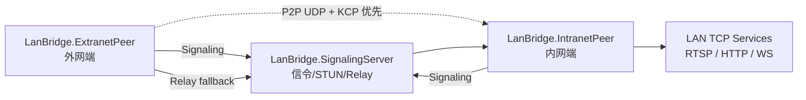

# LanBridge

LanBridge 是一个面向局域网服务访问的 P2P TCP 隧道工具。它让外网设备通过本地端口访问内网端所在局域网里的 TCP 服务，例如 RTSP 摄像头、HTTP 服务、WebSocket 服务、NAS Web 面板等。

LanBridge 会优先尝试 P2P 直连；如果 NAT 条件不允许直连，会自动回退到 Relay 中继链路。

## 特性

- P2P 优先，Relay 自动后备
- 支持标准 STUN Binding 请求
- 支持 NAT 类型诊断
- 支持 KCP 可靠传输
- 支持多个外网端同时连接一个内网端
- 支持一个内网端暴露多台局域网设备
- 支持一个外网端同时映射多路 TCP 服务
- 支持 HTTP、WebSocket、RTSP over TCP 等任意 TCP 协议
- 支持按目标 IP、端口、CIDR 网段配置访问白名单

## 架构



## 项目结构

```text
src/
  LanBridge.Common/           公共协议、STUN、KCP、传输层
  LanBridge.SignalingServer/  信令服务、STUN 服务、Relay 服务
  LanBridge.IntranetPeer/     内网端，连接局域网目标服务
  LanBridge.ExtranetPeer/     外网端，本地 TCP 代理入口
examples/
  server.config.json
  intranet.config.json
  extranet.config.json
```

## 快速开始

### 1. 启动服务端

服务端需要有公网可访问地址，并开放：

- TCP `9000`：信令
- UDP `9001`：STUN
- TCP `9002`：Relay
- UDP `9003`：备用 STUN，用于 NAT 诊断

```powershell
dotnet LanBridge.SignalingServer.dll
```

或使用配置文件：

```powershell
LanBridge.SignalingServer.exe -c .\server.config.json
```

### 2. 启动内网端

允许外网端访问 `192.168.7.0/24` 网段内的任意 TCP 端口：

```powershell
LanBridge.IntranetPeer.exe -sh lanbridge.example.com -sth lanbridge.example.com -th 192.168.7.230 -tp 554 --allow-subnet 192.168.7.0/24
```

也可以使用配置文件：

```powershell
LanBridge.IntranetPeer.exe -c .\intranet.config.json
```

### 3. 启动外网端

通过多条 `--map` 把本地端口映射到内网端可访问的局域网服务：

```powershell
LanBridge.ExtranetPeer.exe -sh lanbridge.example.com -sth lanbridge.example.com -tn intranet-peer-001 `
  -m 8554=192.168.7.230:554 `
  -m 18080=192.168.7.230:80 `
  -m 18081=192.168.7.231:8080 `
  -m 18082=192.168.7.231:3000
```

也可以使用配置文件：

```powershell
LanBridge.ExtranetPeer.exe -c .\extranet.config.json
```

然后从外网端本机访问：

- RTSP：`rtsp://127.0.0.1:8554/...`
- HTTP：`http://127.0.0.1:18080`
- WebSocket：`ws://127.0.0.1:18081`

## 访问控制

内网端默认只允许访问 `--target-host` + `--target-port` 指定的目标。要暴露更多局域网服务，需要显式配置白名单。

允许单个目标和任意端口：

```powershell
--allow-target 192.168.7.230
```

允许单个目标和指定端口：

```powershell
--allow-target 192.168.7.230:554
```

允许一个网段的任意 TCP 端口：

```powershell
--allow-subnet 192.168.7.0/24
```

允许一个网段的指定端口：

```powershell
--allow-subnet 192.168.7.0/24:554
```

也支持显式通配端口：

```powershell
--allow-subnet 192.168.7.0/24:*
```

## 配置文件示例

### 内网端

```json
{
  "nodeId": "intranet-peer-001",
  "signalingServerHost": "lanbridge.example.com",
  "signalingServerPort": 9000,
  "stunServerHost": "lanbridge.example.com",
  "stunServerPort": 9001,
  "stunAlternateServerPort": 9003,
  "targetSourceHost": "192.168.7.230",
  "targetSourcePort": 554,
  "udpPort": 0,
  "verbose": false,
  "allowedSubnets": [
    {
      "cidr": "192.168.7.0/24"
    }
  ]
}
```

### 外网端

```json
{
  "nodeId": "extranet-client-001",
  "signalingServerHost": "lanbridge.example.com",
  "signalingServerPort": 9000,
  "stunServerHost": "lanbridge.example.com",
  "stunServerPort": 9001,
  "stunAlternateServerPort": 9003,
  "targetNodeId": "intranet-peer-001",
  "udpPort": 0,
  "holePunchTimeoutMs": 10000,
  "enableRelayFallback": true,
  "verbose": false,
  "mappings": [
    {
      "localPort": 8554,
      "targetHost": "192.168.7.230",
      "targetPort": 554
    },
    {
      "localPort": 18080,
      "targetHost": "192.168.7.230",
      "targetPort": 80
    }
  ]
}
```

## 构建

```powershell
dotnet build .\LanBridge.slnx -c Release
```

## 发布

```powershell
dotnet publish .\src\LanBridge.SignalingServer\LanBridge.SignalingServer.csproj -c Release -o .\publish\LanBridge.SignalingServer
dotnet publish .\src\LanBridge.IntranetPeer\LanBridge.IntranetPeer.csproj -c Release -o .\publish\LanBridge.IntranetPeer
dotnet publish .\src\LanBridge.ExtranetPeer\LanBridge.ExtranetPeer.csproj -c Release -o .\publish\LanBridge.ExtranetPeer
```

## 传输模式

运行时控制台会醒目显示当前链路：

```text
TRANSPORT MODE: P2P DIRECT
```

或：

```text
TRANSPORT MODE: RELAY MODE
```

P2P 直连失败时，LanBridge 会输出 NAT 诊断信息，并在启用 Relay 的情况下自动回退到中继。

## 支持的协议

LanBridge 转发的是 TCP 字节流，因此理论上支持任意基于 TCP 的应用协议：

- HTTP
- HTTPS
- WebSocket
- RTSP over TCP
- SSH
- MQTT
- 数据库 TCP 连接
- 自定义 TCP 协议

暂不支持：

- UDP
- ICMP
- 组播/广播
- 需要额外动态连接但未配置映射的协议
- RTSP UDP 媒体流

如果使用 RTSP，建议在播放器里强制使用 TCP 传输。

## 安全建议

- 不要把 `0.0.0.0/0` 之类的全网段加入内网端白名单
- 只开放确实需要访问的局域网网段
- 服务端端口建议配合云防火墙限制来源
- 生产环境应使用更强的 token、鉴权和传输加密
- Relay 会经过服务端转发流量，注意带宽和日志留存

## 常见问题

### 为什么有时不是 P2P？

如果任一侧处于对称 NAT、运营商级 NAT 或 UDP 被限制，P2P 打洞可能失败。LanBridge 会自动尝试 Relay 后备链路。

### HTTP 和 WebSocket 能不能用？

可以。外网端把本地端口映射到内网服务端口即可，例如 `18080=192.168.7.230:80`，然后访问 `http://127.0.0.1:18080`。

### 多个外网端能不能同时访问？

可以。每个外网端会建立独立会话，内网端按会话和流 ID 隔离转发。

### 一个外网端能不能同时访问多路服务？

可以。使用多个 `--map`，或者在 `extranet.config.json` 里配置多个 `mappings`。
