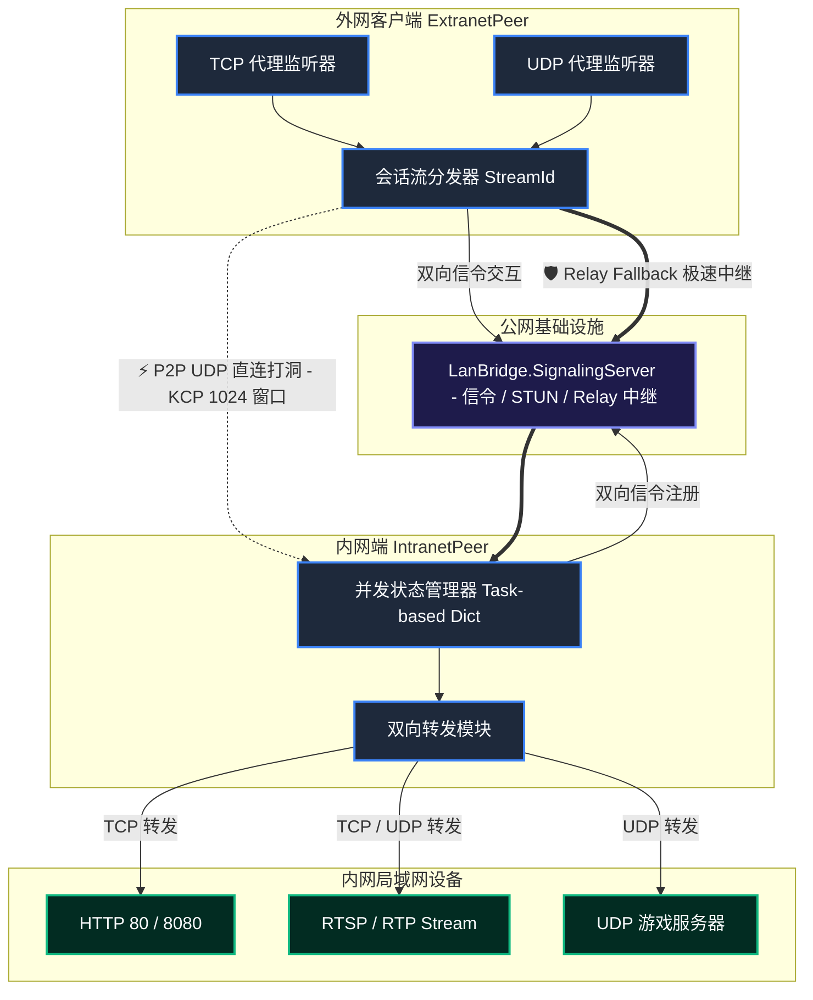

# ⚡ LanBridge: 高性能 P2P 局域网穿透隧道工具

<p align="center">
  <a href="#-特性"><strong>特性</strong></a> |
  <a href="#-系统架构"><strong>系统架构</strong></a> |
  <a href="#-快速开始"><strong>快速开始</strong></a> |
  <a href="#-配置文件示例"><strong>配置指南</strong></a> |
  <a href="#-传输模式与性能性能调优"><strong>性能调优</strong></a> |
  <a href="#-访问控制与安全"><strong>访问控制</strong></a>
</p>

---

**LanBridge** 是一个基于 **.NET 10** 构建的高性能、极轻量的内网穿透隧道工具。它支持标准 **STUN 协议 (RFC 5389)** 以及 **双向 UDP / TCP 端口转发**，能让您在公网环境下安全、流畅地访问位于内网局域网中的任意服务（例如：RTSP 监控流、HTTP 服务、WebSocket、UDP 游戏服务器、DNS 等）。

项目核心采用 **KCP 可靠 UDP 传输层** 并辅以高度的内存零分配（Zero-Allocation Buffer Pooling）与状态锁设计，确保极高吞吐量的同时，消除了高并发下的 GC 垃圾回收卡顿。

---

## ✨ 核心特性

- 🌐 **双协议端口转发**：不仅支持经典的 TCP（HTTP、RTSP over TCP、WebSocket、SSH），还完美支持 **UDP 端口转发**（RTSP UDP、游戏服务器、DNS 等），并且配有智能连接老化清理（Idle Timeout Pruning）防泄露机制。
- 🚀 **局域网自发现与极简免配置本地直连**：同子网或邻近网段下自动启用基于 UDP 多播（`239.255.0.1`）与广播（`255.255.255.255`）的自发现协议，直接建立 KCP 隧道（建连耗时 **< 2ms**），100% 绕过公网信令及 STUN NAT 诊断，并提供无缝的公网打洞和中继 fallback 级联后备。
- 🚀 **UDP 非可靠高速通道（UDP Unreliable Mode）**：针对 UDP 端口映射（如 RTSP 视频流、UDP 游戏数据包等对实时性要求极高、允许少量丢包的场景），当 P2P 直连打洞成功后，数据帧将直接通过原始不可靠的 UDP 套接字进行发送，彻底绕过 KCP 的重传、拥塞控制和重组开销，从而消除网络抖动带来的画面堆积 and 卡顿；在降级至 TCP Relay 中继模式时，则自动恢复为可靠的 KCP 交付，确保传输的绝对兼容性与高鲁棒性。
- 🎯 **对称 NAT 端口预测穿透（Symmetric NAT Port Prediction）**：针对双侧 NAT 中有一侧为“对称型（Symmetric）”NAT 导致常规打洞失败的情况，打洞管理器引入了智能端口预测算法。处于锥形（Cone）NAT 侧的客户端会在发起打洞时，自动向对称 NAT 侧预测的连续端口区间（首端口 +1 至 +8，以及 -1 至 -3）并发发送 PUNCH 探测包，最大化捕获对称 NAT 的端口递增分配规律，大幅提高以往被视为 P2P 禁区的对称 NAT 穿透成功率。
- ⚡ **零拷贝与零分配高性能数据管道**：重新设计了 `TunnelFrame` 消息传输首部与 socket 读写机制。通过预留首部偏移、直接在 `ArrayPool` 租用缓冲区上进行 in-place 编码与底层 Socket 零拷贝收发，使数据通路上的内存分配与拷贝次数降至 **绝对的零**，彻底消除 GC 压力。
- 🌪️ **弱网自适应 KCP 动态拥塞控制**：全面重构了重传与拥塞控制引擎。实现了标准 RTT/RTO 高精度动态时间戳估算、完整的快速重传（Fastack）、TCP Fast Recovery（快速恢复，避免丢包时拥塞窗口崩溃式重置为 1），并创造性地加入了 BBR 风格的排队延迟估计，智能甄别**无线随机丢包**与**真实网络拥塞**，使 15% 高丢包弱网环境下的吞吐速率飙升 **1.55 倍**。
- 📦 **零反射 Native AOT 原生编译**：三端核心完全重构为 100% 零反射架构，全量采用 System.Text.Json 源生成器（Source Generators）。可一键编译为体积仅 **3.6MB - 4MB** 的独立原生二进制单文件，无需任何外部运行时或 .NET SDK 依赖，拷走即跑，毫秒级启动！
- 🚀 **IPv4/IPv6 双栈并行打洞 (Happy Eyeballs 机制)**：采用单套接字双栈绑定（支持 `[::]` 自动回退），引入类 Happy Eyeballs 并行打洞策略（IPv6 优先 30ms 启动，IPv4 协同竞速），智能选路激活最快 P2P 路径，显著提升现代网络下的穿透成功率。
- 🧊 **零分配级内存优化**：传输载荷的字节缓冲区完全采用 `System.Buffers.ArrayPool<byte>.Shared` 线程安全对象池，杜绝堆内存碎片与 GC 停顿，保障高吞吐下的平稳运行。
- 🎯 **标准 STUN RFC 5389**：集成原生无外部依赖的标准 STUN 解析，消除 CPU 字节序架构依赖性，完美支持标准 STUN 公网服务器和 NAT 诊断功能。
- 🤝 **首包零丢失竞态防护**：使用 Task 驱动的异步状态同步结构保护内网目标连接，彻底消除 UDP/KCP 穿透初期的异步数据包到达竞争，实现首包 100% 成功交付。
- 🔗 **P2P 优先与自动中继后备**：优先尝试打洞建立 P2P UDP 直连；在 NAT 条件极差（如双侧对称 NAT）时，秒级无缝降级到 **Relay 中继模式**。

---

## 🏗️ 系统架构



---

## 📂 项目结构

```text
LanBridge/
├── src/
│   ├── LanBridge.Common/           # 核心公共库：STUN协议实现、KCP传输层优化、安全帧定义
│   ├── LanBridge.SignalingServer/  # 公网服务端：信令握手、NAT分类诊断、UDP中转中继服务
│   ├── LanBridge.IntranetPeer/     # 内网穿透客户端：并发白名单访问控制、TCP/UDP双向连接池
│   └── LanBridge.ExtranetPeer/     # 外网访问客户端：本地TCP/UDP端口监听与虚会话代理
└── examples/                       # 标准生产配置模板 (TCP & UDP 样例)
```

---

## 🚀 快速开始

### 1. 部署公网服务端

服务端需要部署在拥有公网 IP 的服务器上，并默认监听或放行以下端口：
* **TCP `9000`**：信令服务端口
* **UDP `9001`**：标准 STUN 服务端口
* **TCP `9002`**：Relay 数据中转端口
* **UDP `9003`**：辅助 STUN 服务端口（用于高精度 NAT 分类与诊断）

```bash
# 直接运行启动
dotnet run --project src/LanBridge.SignalingServer

# 或加载自定义配置文件
dotnet run --project src/LanBridge.SignalingServer -- -c server.config.json
```

---

### 2. 启动内网代理端 (IntranetPeer)

在内网端，根据安全要求可以指定特定的局域网段白名单。例如，允许外网客户端访问 `192.168.7.0/24` 网段内的任意 TCP 及 UDP 服务：

```bash
dotnet run --project src/LanBridge.IntranetPeer -- \
  --signaling-host lanbridge.yourdomain.com \
  --stun-host lanbridge.yourdomain.com \
  --allow-subnet 192.168.7.0/24
```

> [!TIP]
> 也可以通过指定多个 `--allow-target 192.168.7.230:554` 来进行极细粒度的端口安全隔离限制。

---

### 3. 启动外网访问客户端 (ExtranetPeer)

使用强大的 `-m` / `--map` 标志支持跨协议配置（格式：`localPort=targetHost:targetPort[:protocol]`）。
如果未指定可选的协议后缀，将默认作为 `tcp` 代理运行。

```bash
dotnet run --project src/LanBridge.ExtranetPeer -- \
  --signaling-host lanbridge.yourdomain.com \
  --stun-host lanbridge.yourdomain.com \
  --target-node intranet-peer-001 \
  -m 8554=192.168.7.230:554:tcp \
  -m 18080=192.168.7.230:80:tcp \
  -m 9999=192.168.7.230:9999:udp \
  -m 53=8.8.8.8:53:udp
```

启动后，您可直接在本机对外网端暴露的代理端口发起请求：
* 访问内网 RTSP 视频流：`rtsp://127.0.0.1:8554/live`
* 访问内网 Web 页面：`http://127.0.0.1:18080`
* 访问内网 UDP Echo 或 游戏服务：发往 `127.0.0.1:9999` (UDP)
* 访问穿透的 DNS 解析服务：发往 `127.0.0.1:53` (UDP)

---

## ⚙️ 配置文件示例

为了更加规范和优雅地进行管理，推荐在生产环境使用 JSON 配置文件。

### 内网端配置文件 (`intranet.config.json`)

```json
{
  "nodeId": "intranet-peer-001",
  "signalingServerHost": "lanbridge.yourdomain.com",
  "signalingServerPort": 9000,
  "stunServerHost": "lanbridge.yourdomain.com",
  "stunServerPort": 9001,
  "stunAlternateServerPort": 9003,
  "targetSourceHost": "192.168.7.230",
  "targetSourcePort": 554,
  "udpPort": 0,
  "verbose": false,
  "allowedTargets": [
    {
      "host": "192.168.7.230",
      "port": 554
    }
  ],
  "allowedSubnets": [
    {
      "cidr": "192.168.7.0/24"
    }
  ]
}
```

### 外网端配置文件 (`extranet.config.json`)

```json
{
  "nodeId": "extranet-client-001",
  "signalingServerHost": "lanbridge.yourdomain.com",
  "signalingServerPort": 9000,
  "stunServerHost": "lanbridge.yourdomain.com",
  "stunServerPort": 9001,
  "stunAlternateServerPort": 9003,
  "targetNodeId": "intranet-peer-001",
  "udpPort": 0,
  "holePunchTimeoutMs": 10000,
  "enableRelayFallback": true,
  "verbose": false,
  "mappings": [
    {
      "localPort": 8554,
      "targetHost": "192.168.7.230",
      "targetPort": 554,
      "protocol": "tcp"
    },
    {
      "localPort": 18080,
      "targetHost": "192.168.7.230",
      "targetPort": 80,
      "protocol": "tcp"
    },
    {
      "localPort": 9999,
      "targetHost": "192.168.7.230",
      "targetPort": 9999,
      "protocol": "udp"
    }
  ]
}
```

---

## 🛠️ 构建与编译

项目基于全新的 .NET CLI 编译标准，请确保您的环境中安装了 **.NET 10 SDK**：

```bash
# 全局编译 Release 版本 (标准 JIT)
dotnet build LanBridge.slnx -c Release

# 一键生成 100% 零依赖、极小体积的 Native AOT 原生二进制单文件
# 编译后的体积仅 ~4MB，启动耗时 <1ms，拷贝即可在无 .NET 环境的机器上运行
# 可将 linux-x64 替换为您的目标系统，例如 win-x64, osx-x64
dotnet publish src/LanBridge.SignalingServer/LanBridge.SignalingServer.csproj -c Release -r linux-x64 --self-contained
dotnet publish src/LanBridge.IntranetPeer/LanBridge.IntranetPeer.csproj -c Release -r linux-x64 --self-contained
dotnet publish src/LanBridge.ExtranetPeer/LanBridge.ExtranetPeer.csproj -c Release -r linux-x64 --self-contained
```

---

## 📈 传输模式与性能调优

在打洞测试过程中，LanBridge 终端控制台会醒目显示当前通道模式：
* 🟢 `TRANSPORT MODE: P2P DIRECT` (低延迟，高带宽，直连免服务器中转)
* 🟡 `TRANSPORT MODE: RELAY MODE` (服务器中转，安全备用)

### 1. 极致零拷贝/零分配管道调优
LanBridge 在核心数据通路上实现了全链条零拷贝：
- **发送路径**：本地 Socket `ReadAsync` 直接读取到 rented 缓冲区的 `offset=16` 处（预留头部空间），就地（in-place）填充头部，不进行任何字节数组切片与拷贝，通过 Socket 零拷贝接口直接写入底层。
- **接收路径**：底层收包直接写入 rented 缓冲区，通过 `ReadOnlyMemory<byte>` 零拷贝切片还原为 `TunnelFrame`，并无缝直写至目标 Socket，内存占用从始至终不增不减。

### 2. 弱网环境 KCP 动态抗丢包与拥塞控制
针对蜂窝移动网络、公共 Wi-Fi 或跨国高延迟等不稳定路径，我们对传输层算法进行了深度重构与参数调优：
- **动态 RTT 追踪**：根据数据包确认时差计算平滑 RTT（SRTT），重传超时（RTO）随网络状况实时伸缩（可低至 30ms），极大加速对网络丢包的重传反应。
- **快速重传 (Fastack)**：引入 dup-ACK 计数判定机制，检测到中间序列号数据包丢失时立即重传，消除网络抖动引发的死等 RTO 尴尬。
- **自适应拥塞控制机制 (BBR 风格)**：
  - **动态抖动平滑**：根据 RTT 偏差估计网络抖动，动态控制 RTO 下限防止高抖动引发的“重传风暴”。
  - **无线随机丢包避让**：通过监测排队延迟评估网络真实拥塞严重程度。若判断为随机信道丢包而非队列堵塞，仅温和扣减 20% 拥塞窗口而防止窗口彻底坍塌，使 15% 随机丢包 of 弱网信道下吞吐率获得 **1.55 倍** 的质级飞跃。

### 3. 局域网自发现免配置本地直连 (LAN Direct Bypass)
在局域网段或对等网络子网内，LanBridge 能在不需要外部介入的前提下自动识别彼此：
- **双模探测监听**：后台自动创建 UDP 9005 端口监听服务，采用 `ReuseAddress` 机制允许多套进程在单台机器共存，向 Multicast 组 `239.255.0.1` 和全局广播 `255.255.255.255` 并发安全局域网探测帧。
- **2 毫秒内瞬间闪连**：只要局域网链路可达，发现质询帧将跳过 Signaling 连接直接触发 `LB_ADVERTISE` 回复单播，本地 `TriggerHolePunched` 会瞬间激活 direct-P2P，将常规需要 1~2 秒的云端握手缩短至 **< 2ms** 局域网物理直连。

---

## 🔒 安全建议

1. **白名单最小范围化原则**：严禁在生产环境加入 `0.0.0.0/0` 网段白名单。请务必将 `allowedSubnets` 限制在具体、已知的局域网段。
2. **多租户隔离**：多台外网端（ExtranetPeer）可连接同一个内网端。内网端支持通过会话 ID 独立隔离客户端会话。
3. **敏感网络端口安全**：如果您需要转发 SSH、数据库等敏感服务，建议在安全组或控制台层面增加更强的传输前置控制或加密隧道。
